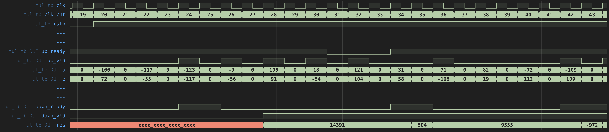
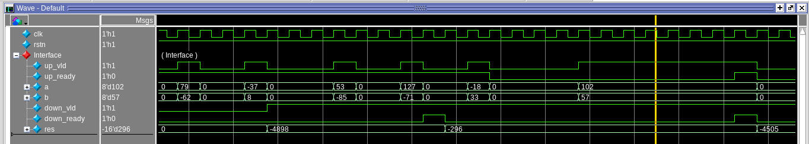
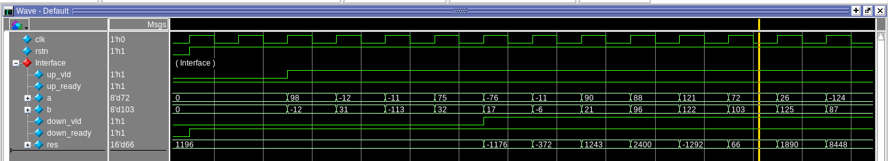
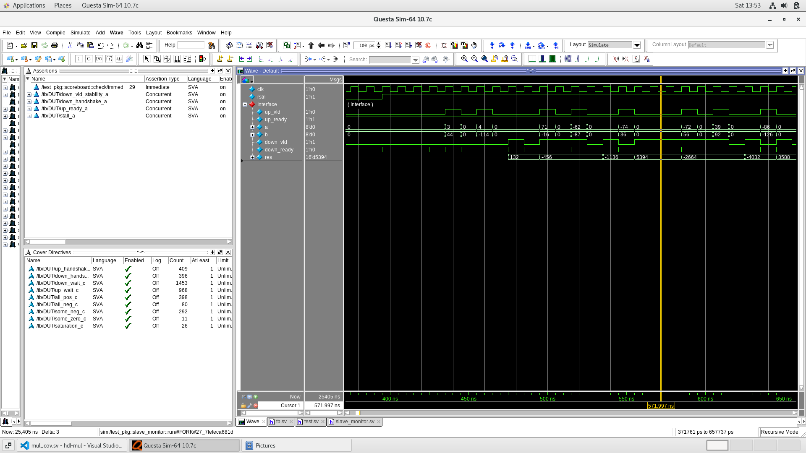
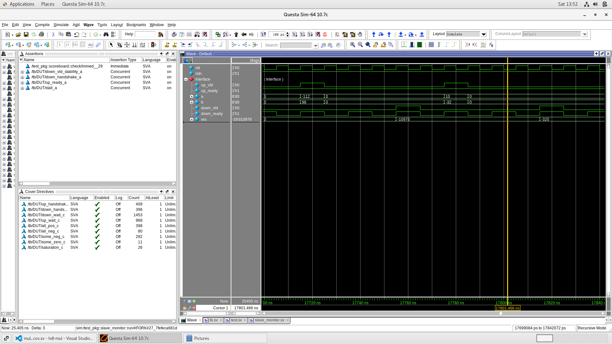
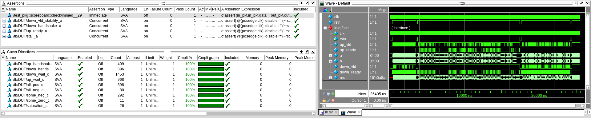

# 8-bit Pipelined Multiplier




## Description

This is an implementation of a 8-bit signed integer multiplication module that incorporates techniques to increase clock frequency, throughput, and energy efficiency. This module has the potential to be used for multiplication in digital signal processing, computer arithmetic (in ALU's), and other applications requiring fast and efficient multiplication.

This is an educational project aimed at practicing  techniques drawn from the [“Chip Design School”](https://engineer.yadro.com/chip-design-school/) course and the book [“Digital Design: A Systems Approach”](https://www.amazon.com/Digital-Design-Approach-William-Dally/dp/0521199506) such as valid-ready protocol, pipelining with backpressure, Booth encoding, Wallace trees, clock gating.

## Synthesis Results

Here are the results of the synthesis of different implementations of the multiplier such as pipelined, pure combinational, default Quartus synthesis (without DSP).

| Pipelined, MHz | Combinational, MHz | assign res = a * b, MHz |
|----------------|--------------------|-------------------------|
| $$311.62$$     |     $$129.80$$     |         $$133.46$$      |


## Implementation Features

### Booth's Recoding

The unsigned binary multiplier generates $m \times n$ - bit partial products and requires $m \times (n - 1)$ full adder cells to sum these partial products into a final result. We can reduce the number of partial products a factor of 2 or more using Booth recoding. As an added bonus, the recoding easily handles 2's complement signed inputs. For example, we can reinterpret the 6-bit number $b = 011011_2$ as the radix-4 number $123_4$, we need to sum only three partial products.


### Wallace Tree

The Wallace algorithm is a efficient data compression strategy that reduces the critical path by computing intermediate sums and carry values in parallel, deferring the final “heavy addition” (ripple-carry-adder) to the very last stage of the computation. We can reduce this $O(n)$ delay in accumulating partial products to an $O(\log(n))$ delay by organizing adders in a tree, rather than linear arrays. A carry-look-ahead adder can then be used for the final summation.

The reduction algorithm is shown in the following figure (the radix-4 Booth recoding was applied at the beginning):


### Pipelining

We can take an overall task and break it into subtasks. The stages are tied together in a linear manner so that the output of each unit is the input of the next unit.


### Valid-Ready Protocol

The valid-ready protocol is a handshake mechanism. It ensures smooth data flow between a producer (the data source) and a consumer (the data sink), enabling reliable and synchronized communication in hardware systems.


Valid-Ready protocol rules:
1. A data transfer occurs only when both the `valid` and `ready` signals are high. This ensures that the producer has valid data to send and the consumer is ready to receive it.
2. The producer asserts the `valid` high whenever valid data is available for transfer. Importantly, the `valid` remains high until the transaction is complete.
3. The `valid` from the producer must be independent of the `ready` from the consumer. This design ensures that the producer can signal the availability of data without waiting for the consumer’s readiness.
4. The slave is permitted to set (and clear) the `ready`  until the `valid` appears.

It is not recommended to default `ready` set to 0 because it forces the transfer to take at least two cycles, one to assert `valid` and another to assert `ready`.

### Combinational Back-To-Back
This combinational logic helps prevent the pipeline from coming to a stall. If the receiver is not ready to accept data (`down_ready = 0`), the pipeline will continue to accept data until it is completely full. Clock gating is implemented here using the register enable signal. This makes the design more power efficient.


## Submodules

### Carry Save Adder


### Radix-4 Booth Recoder


## Verification
The verification environment has a standard structure. The environment consists of `master` and `slave` agents that generate signals to the corresponding DUT ports, monitor handshakes on both sides, and send port state "slices" during handshakes to the `scoreboard`. All of this works via mailboxes. The scoreboard compares the expected result with the result from the DUT outpuе and asserts any mismatches. The test environment is placed in a `test` class, which configures the agents and the scoreboard. The test class is placed in the `testbench`. Interaction between the test and the DUT is carried out via a virtual interface.


### SVA and Coverage
The SystemVerilog assertions are located in the multiplier module and verify that the module adheres to the valid-ready protocol and that the pipeline stall is functioning correctly. Concurrent assertions were used to define these assertions. 

Cover properties are also located in this module and cover the valid-ready protocol, various combinations of input values, and pipeline stalls.

### Test Scenarios
Test scenarios are randomized tests that differ in terms of the frequency and duration of input ports from the master and slave to the DUT:
* **Busy slave:** a scenario in which the master's request rate is an order of magnitude higher than the slave's response rate.



* **Free fall:** a scenario in which data passes through the pipeline without stalls.



* **Overloaded:** a scenario in which there are intensive requests from the master and intensive repsonses from the slave.



* **Sparse**: a scenario in which master's requests are rare, and the slave is always ready to receive data.



## Verification Results
According to the simulation results, none of the assertions triggered, and all the coverage targets were met.



Below is the output from the Questa Sim simulator console. No errors occurred, so everything is working :)

```
# =====================================================
# Name: Test (Overloaded)
# Desc: A scenario in which there are intensive requests
#  from the master and intensive repsonses from the slave.
# ------------------ Configurations -------------------
# Tests's enviroment configs:
# 	packet_num              = 100
# 	timeout                 = 10000
# 
# Master's driver configs:
# 	master_driver_min_delay = 1
# 	master_driver_max_delay = 3
# 
# Slave's driver configs:
# 	slave_driver_min_delay  = 1
# 	slave_driver_max_delay  = 3
# -------------------- Simulation ---------------------
# Simulating...
# =====================================================
# 
# =====================================================
# Name: Test (Busy Slave)
# Desc: A scenario in which the master's request rate
#  is an order of magnitude higher than
#  the slave's response rate.
# ------------------ Configurations -------------------
# Tests's enviroment configs:
# 	packet_num              = 100
# 	timeout                 = 10000
# 
# Master's driver configs:
# 	master_driver_min_delay = 1
# 	master_driver_max_delay = 5
# 
# Slave's driver configs:
# 	slave_driver_min_delay  = 10
# 	slave_driver_max_delay  = 15
# -------------------- Simulation ---------------------
# Simulating...
# =====================================================
# 
# =====================================================
# Name: Test (Sparse)
# Desc: A scenario in which master's requests are rare,
#  and the slave is always ready to receive data.
# ------------------ Configurations -------------------
# Tests's enviroment configs:
# 	packet_num              = 100
# 	timeout                 = 10000
# 
# Master's driver configs:
# 	master_driver_min_delay = 1
# 	master_driver_max_delay = 10
# 
# Slave's driver configs:
# 	slave_driver_min_delay  = 1
# 	slave_driver_max_delay  = 1
# -------------------- Simulation ---------------------
# Simulating...
# =====================================================
# 
# =====================================================
# Name: Test (Free fall)
# Desc: A scenario in which data passes through
#  the pipeline without stalls.
# ------------------ Configurations -------------------
# Tests's enviroment configs:
# 	packet_num              = 100
# 	timeout                 = 10000
# 
# Master's driver configs:
# 	master_driver_min_delay = 0
# 	master_driver_max_delay = 0
# 
# Slave's driver configs:
# 	slave_driver_min_delay  = 0
# 	slave_driver_max_delay  = 0
# -------------------- Simulation ---------------------
# Simulating...
# =====================================================
# ** Note: $finish    : ./tb/tb.sv(103)
#    Time: 25405 ns  Iteration: 2  Instance: /tb
```