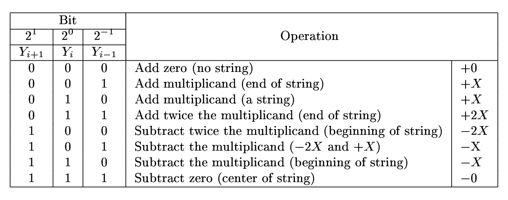

# 8-bit Piplined Multiplier

## Description

This is an implementation of a 8-bit signed integer multiplication module that incorporates techniques to increase clock frequency, throughput, and energy efficiency. This module has the potential to be used for multiplication in digital signal processing, computer arithmetic (in ALU's), and other applications requiring fast and efficient multiplication.

This is an educational project aimed at practicing  techniques drawn from the [“Chip Design School”](https://engineer.yadro.com/chip-design-school/) course and the book [“Digital Design: A Systems Approach”](https://www.amazon.com/Digital-Design-Approach-William-Dally/dp/0521199506) such as valid-ready protocol, pipelining with backpressure, Booth encoding, Wallace trees, clock gating.

## Implementation Features

### Booth's Recoding

The unsigned binary multiplier generates $m \times n$ - bit partial products and requires $m \times (n - 1)$ full adder cells to sum these partial products into a final result. We can reduce the number of partial products a factor of 2 or more using Booth recoding. As an added bonus, the recoding easily handles 2's complement signed inputs. For example, we can reinterpret the 6-bit number $b = 011011_2$ as the radix-4 number $123_4$, we need to sum only three partial products.

### Wallace Tree

The Wallace algorithm is a efficient data compression strategy that reduces the critical path by computing intermediate sums and carry values in parallel, deferring the final “heavy addition” (ripple-carry-adder) to the very last stage of the computation. We can reduce this $O(n)$ delay in accumulating partial products to an $O(\log(n))$ delay by organizing adders in a tree, rather than linear arrays. A carry-look-ahead adder can then be used for the final summation.

The reduction algorithm is shown in the following figure (the radix-4 Booth recoding was applied at the beginning):

### Pipelining

We can take an overall task and break it into subtasks. The stages are tied together in a linear manner so that the output of each unit is the input of the next unit.

### Valid-Ready Protocol

The valid-ready protocol is a handshake mechanism. It ensures smooth data flow between a producer (the data source) and a consumer (the data sink), enabling reliable and synchronized communication in hardware systems.

Valid-Ready protocol rules:
1. A data transfer occurs only when both the `valid` and `ready` signals are high. This ensures that the producer has valid data to send and the consumer is ready to receive it.
2. The producer asserts the `valid` high whenever valid data is available for transfer. Importantly, the `valid` remains high until the transaction is complete.
3. The `valid` from the producer must be independent of the `ready` from the consumer. This design ensures that the producer can signal the availability of data without waiting for the consumer’s readiness.
4. The slave is permitted to set (and clear) the `ready`  until the `valid` appears.

It is not recommended to default `ready` set to 0 because it forces the transfer to take at least two cycles, one to assert `valid` and another to assert `ready`.

### Combinational Back-To-Back
This combinational logic helps prevent the pipeline from coming to a stall. If the receiver is not ready to accept data (`down_ready = 0`), the pipeline will continue to accept data until it is completely full. Clock gating is implemented here using the register enable signal. This makes the design more power efficient.

## Submodules

### Carry Save Adder

### Radix-4 Booth Recoder
